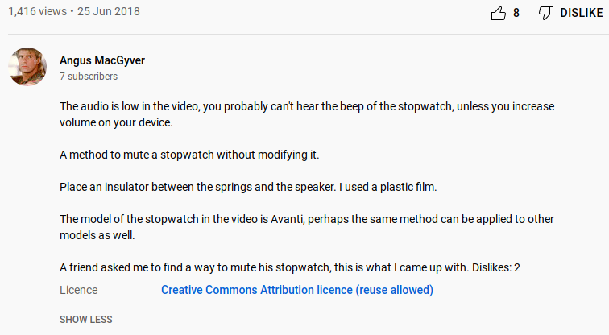

# Description

Add number of dislikes to the description of your YouTube videos. Number of
dislikes are updated if you let this function as a bot.

# Requirements

Python dependencies can be found in [requirements.txt](requirements.txt).

You will need to create a project on Google Developers Console and YouTube Data
API credentials. The credentials must be OAuth2. See [getting started guide](https://developers.google.com/youtube/v3/getting-started).
Use the same Google account you use YouTube with.

After the first step, download OAuth client file and rename it to `client_secret.json`.

That's all, now run the script.

# Quota

You will have 10,000 units quota per day using the YouTube API. On each round
2 + number_of_videos * 1-51 units are used.

# Screenshot

# License

GPL3.
